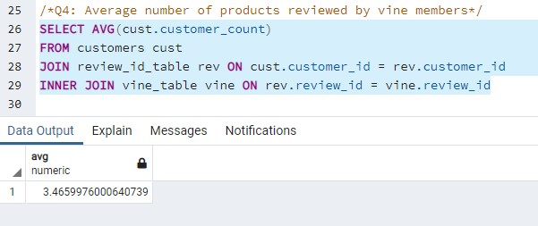
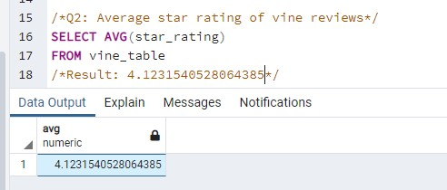
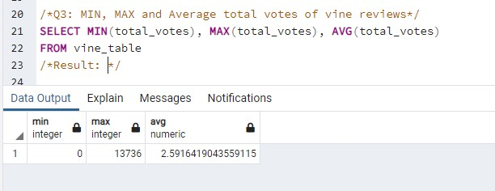

# big-data-challenge
# Overview
In this assignment we reviewed the star ratings for Amazon vine users who purchased an item categorized as home improvement or home entertainment. All data collection and loading 

# Analysis
After loading the data, we asked the following questions to determine the reliability of vine reviews compared to the population.

Minimum star ratings for Amazon during the data collection period were zero, with a maximum of 5 stars.

1. What portion of home improvement/entertainment products have vine reviews?
2. How many home improvement/entertainment products does the average vine reviewer review?
3. What was the average star rating of a vine review?
4. How many people read and voted on the quality of vine reviews?

# Results

For Question 1: Querying the collected data, we found that every single product in the selected categories had at least one vine reviewer. This shows that there is not a preference for reviews from vine reviewers - and that vine reviewers may overreview to maximize returns and profit. 393645/393645 products had a vine review.

For Question 2: We continue to address the prior concern that vine reviewers may overreview by checking the number of products reviewed on average. For this, we found that vine reviewers average 3.46 reviews in these categories. This now indicates that, due to the large number of items, that there are enough vine reviewers to cover the entire product categories for reviews.

For Question 3: We check to see the positivity and negativity bias of vine reviews to determine if there is a normalization of positivity on products purchased. We found that vine reviewers on average give over 4 stars, meaning that being rewarded for reviews may influence the review to encourage purchase and favorability.

For Question 4: We then checked the impact on other customers to determine the community impact of vine reviews. We found that while the minimum and maximum number of customers who responded to the review's impact varied wildly, the average number of people who marked influence was just under 3 people per vine review. 

# Conclusion

While it is positive to see that vine reviews are covering the entire product sphere allowing customer reference on even fringe items, because of the average customer impact determined by marked influence and the overall skew towards higher scoring for all products, we cannot reccomend a vine review for home improvement and home entertainment items to be relevant to a consumer purchase.
